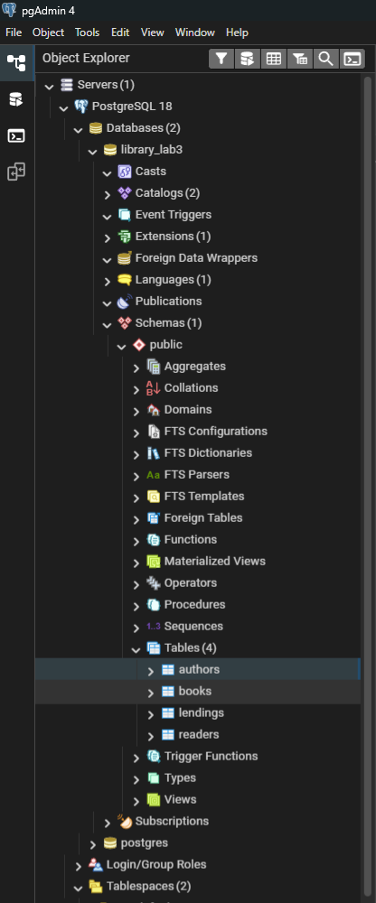
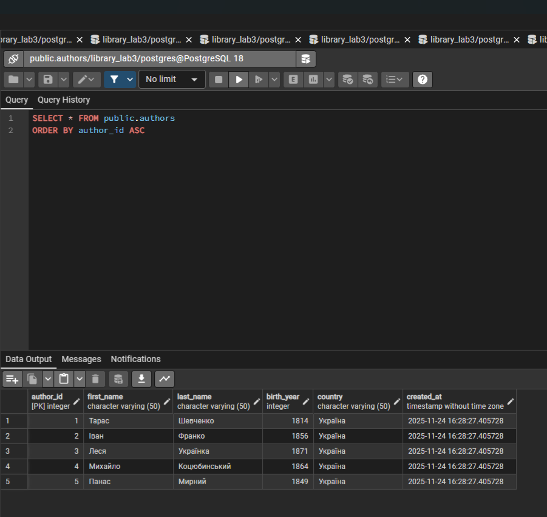
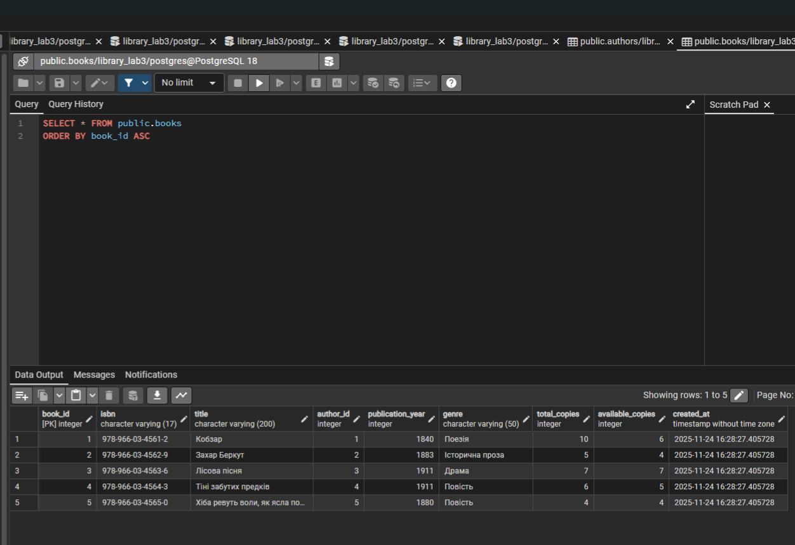
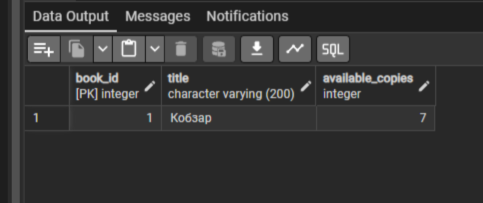
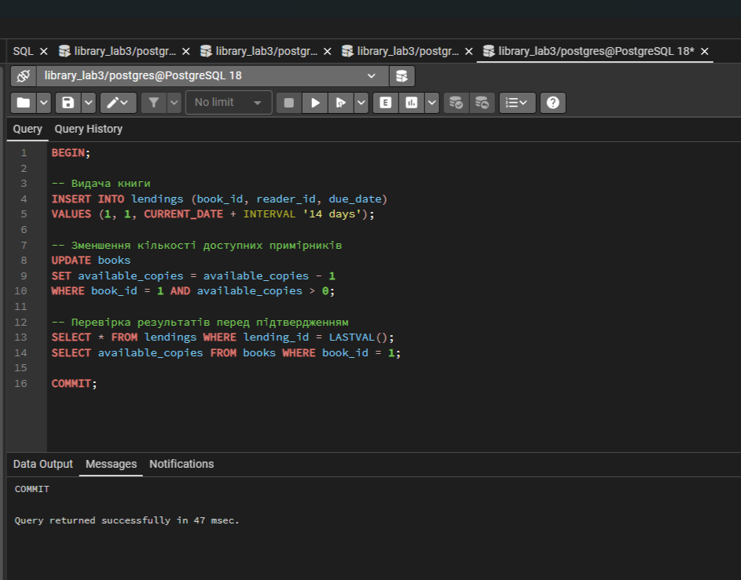
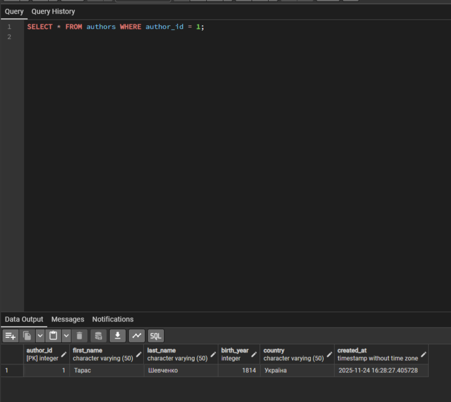
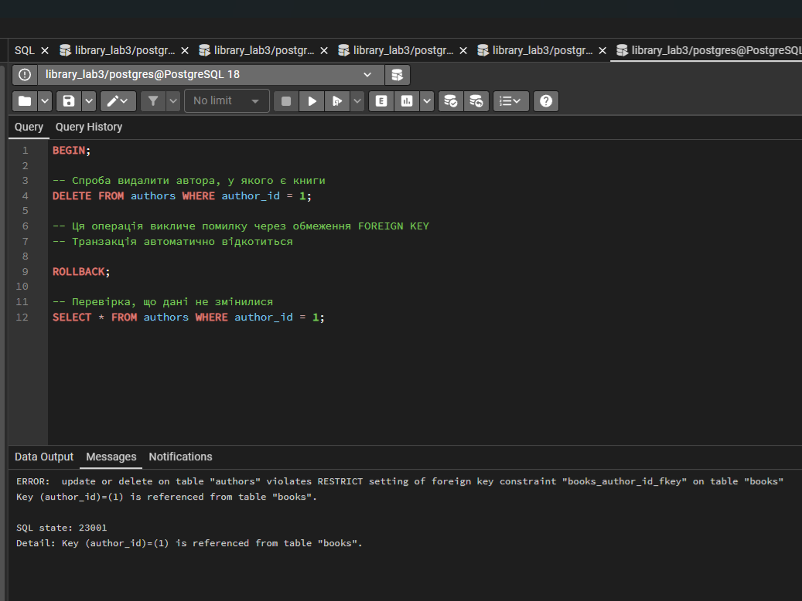
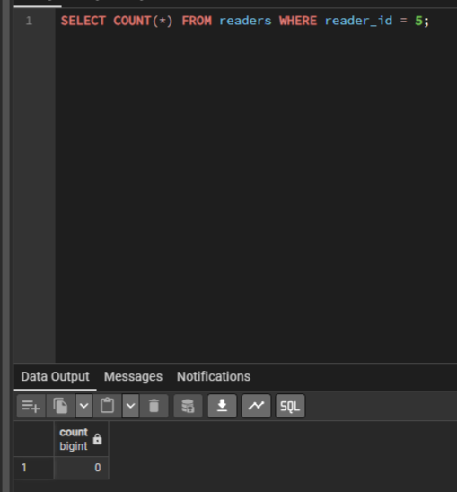

# Звіт з лабораторної роботи 3. Модифікація даних та транзакції

**Виконав:** Федорчук Богдан
**Група:** ІПЗ-31
**Дата виконання:** 15 жовтня 2025 року
**Варіант:** Система управління бібліотекою

## Мета роботи

Здобути практичні навички безпечної модифікації даних у реляційних базах даних, опанувати механізми транзакцій для забезпечення цілісності даних, навчитися працювати з обмеженнями цілісності та каскадними операціями при зміні взаємопов'язаних записів.

## Виконання роботи

### Рівень 1. Базові операції модифікації

#### Крок 1. Створення структури бази даних

Я завантажив PosgreSQL після чого відкрив pgAdmain, де створив нову базу даних library_lab3;

**Таблиця авторів з обмеженнями:**
```sql
-- Таблиця авторів
CREATE TABLE authors (
    author_id SERIAL PRIMARY KEY,
    first_name VARCHAR(50) NOT NULL,
    last_name VARCHAR(50) NOT NULL,
    birth_year INTEGER CHECK (birth_year >= 1000 AND birth_year <= EXTRACT(YEAR FROM CURRENT_DATE)),
    country VARCHAR(50),
    created_at TIMESTAMP DEFAULT CURRENT_TIMESTAMP
);

-- Таблиця книг
CREATE TABLE books (
    book_id SERIAL PRIMARY KEY,
    isbn VARCHAR(17) UNIQUE NOT NULL,
    title VARCHAR(200) NOT NULL,
    author_id INTEGER NOT NULL,
    publication_year INTEGER CHECK (publication_year >= 1450),
    genre VARCHAR(50),
    total_copies INTEGER DEFAULT 1 CHECK (total_copies >= 0),
    available_copies INTEGER DEFAULT 1 CHECK (available_copies >= 0),
    created_at TIMESTAMP DEFAULT CURRENT_TIMESTAMP,
    FOREIGN KEY (author_id) REFERENCES authors(author_id) ON DELETE RESTRICT,
    CHECK (available_copies <= total_copies)
);

-- Таблиця читачів
CREATE TABLE readers (
    reader_id SERIAL PRIMARY KEY,
    first_name VARCHAR(50) NOT NULL,
    last_name VARCHAR(50) NOT NULL,
    email VARCHAR(100) UNIQUE NOT NULL,
    phone VARCHAR(20),
    library_card_number VARCHAR(20) UNIQUE NOT NULL,
    registration_date DATE DEFAULT CURRENT_DATE,
    status VARCHAR(20) DEFAULT 'Active' CHECK (status IN ('Active', 'Blocked', 'Inactive'))
);

-- Таблиця видач книг
CREATE TABLE lendings (
    lending_id SERIAL PRIMARY KEY,
    book_id INTEGER NOT NULL,
    reader_id INTEGER NOT NULL,
    lending_date DATE DEFAULT CURRENT_DATE,
    due_date DATE NOT NULL,
    return_date DATE,
    FOREIGN KEY (book_id) REFERENCES books(book_id) ON DELETE RESTRICT,
    FOREIGN KEY (reader_id) REFERENCES readers(reader_id) ON DELETE RESTRICT,
    CHECK (due_date > lending_date),
    CHECK (return_date IS NULL OR return_date >= lending_date)
);
``` 
Cтворено чотири взаємопов’язані таблиці для системи управління бібліотекою: authors, books, readers та lendings. Для забезпечення цілісності використано різні обмеження: PRIMARY KEY для унікальної ідентифікації записів, FOREIGN KEY для зв’язків між таблицями з політикою ON DELETE RESTRICT, UNIQUE для заборони дублювання важливих полів, а також CHECK для контролю коректності даних. 

**Результат створення структури:**



#### Крок 2. Додавання тестових дани

Додав початкові дані до таблиць

```sql
-- Додавання авторів
INSERT INTO authors (first_name, last_name, birth_year, country)
VALUES
    ('Тарас', 'Шевченко', 1814, 'Україна'),
    ('Іван', 'Франко', 1856, 'Україна'),
    ('Леся', 'Українка', 1871, 'Україна'),
    ('Михайло', 'Коцюбинський', 1864, 'Україна'),
    ('Панас', 'Мирний', 1849, 'Україна');

-- Додавання книг
INSERT INTO books (isbn, title, author_id, publication_year, genre, total_copies, available_copies)
VALUES
    ('978-966-03-4561-2', 'Кобзар', 1, 1840, 'Поезія', 10, 8),
    ('978-966-03-4562-9', 'Захар Беркут', 2, 1883, 'Історична проза', 5, 4),
    ('978-966-03-4563-6', 'Лісова пісня', 3, 1911, 'Драма', 7, 7),
    ('978-966-03-4564-3', 'Тіні забутих предків', 4, 1911, 'Повість', 6, 5),
    ('978-966-03-4565-0', 'Хіба ревуть воли, як ясла повні', 5, 1880, 'Повість', 4, 4);

-- Додавання читачів
INSERT INTO readers (first_name, last_name, email, phone, library_card_number)
VALUES
    ('Олена', 'Петренко', 'olena.petrenko@email.com', '+380501234567', 'LIB-2024-001'),
    ('Андрій', 'Коваленко', 'andrii.kovalenko@email.com', '+380502345678', 'LIB-2024-002'),
    ('Марія', 'Сидоренко', 'maria.sydorenko@email.com', '+380503456789', 'LIB-2024-003'),
    ('Іван', 'Мельник', 'ivan.melnyk@email.com', '+380504567890', 'LIB-2024-004');
```

**Перевірка доданих авторів**



**Перевірка додавання книг:**



**Перевірка додавання читачів:**


#### Крок 3. Безпечне оновлення записів

```sql
-- Перевірка перед оновленням
SELECT book_id, title, available_copies
FROM books
WHERE book_id = 1;

-- Оновлення кількості доступних примірників
UPDATE books
SET available_copies = available_copies - 1
WHERE book_id = 1 AND available_copies > 0;

-- Перевірка результату
SELECT book_id, title, available_copies
FROM books
WHERE book_id = 1;
```

**Результат перевірки:**



#### Крок 4. Операції з транзакціями
```sql 
BEGIN;

-- Видача книги
INSERT INTO lendings (book_id, reader_id, due_date)
VALUES (1, 1, CURRENT_DATE + INTERVAL '14 days');

-- Зменшення кількості доступних примірників
UPDATE books
SET available_copies = available_copies - 1
WHERE book_id = 1 AND available_copies > 0;

-- Перевірка результатів перед підтвердженням
SELECT * FROM lendings WHERE lending_id = LASTVAL();
SELECT available_copies FROM books WHERE book_id = 1;

COMMIT;
```

**Результат:**

COMMIT

Query returned successfully in 47 msec.

**Аналіз транзакції:**

Наведена транзакція моделює процес видачі книги читачу в бібліотечній системі. Після початку транзакції (BEGIN) виконується вставка нового запису у таблицю lendings, де фіксується факт видачі книги з зазначенням дати повернення. Далі виконується оновлення таблиці books, яке зменшує кількість доступних примірників книги на один — це забезпечує актуальний стан книжного фонду. Після цього виконуються контрольні запити SELECT, які дозволяють перевірити правильність внесених змін перед їх підтвердженням. Завершується транзакція командою COMMIT, яка фіксує всі зміни в базі даних. Такий підхід гарантує цілісність даних: якщо одна з операцій виконалась неправильно, перед COMMIT транзакцію можна було б скасувати.



#### Крок 5. Демонстрація ROLLBACK

Показано, що транзакція невідбулася при винекнені помилки.

``` sql
BEGIN;

-- Спроба видалити автора, у якого є книги
DELETE FROM authors WHERE author_id = 1;

-- Ця операція викличе помилку через обмеження FOREIGN KEY
-- Транзакція автоматично відкотиться

ROLLBACK;

-- Перевірка, що дані не змінилися
SELECT * FROM authors WHERE author_id = 1;
```

**Результат:**

ERROR:  update or delete on table "authors" violates RESTRICT setting of foreign key constraint "books_author_id_fkey" on table "books"
Key (author_id)=(1) is referenced from table "books". 

SQL state: 23001
Detail: Key (author_id)=(1) is referenced from table "books".

**Перевірка що дані не змінилися:**



**Висновок:**
У даній транзакції була виконана спроба видалити автора, на якого все ще посилаються записи в таблиці books. Це призвело до спрацювання обмеження FOREIGN KEY, яке забороняє видалення пов’язаних даних і тим самим гарантує цілісність бази даних. Внаслідок помилки транзакція автоматично перейшла у стан невдалого виконання, після чого була виконана команда ROLLBACK, що повністю відмінила всі незавершені зміни. Перевірка даних після відкату підтвердила, що автор залишився в таблиці, а структура бази не була порушена. Таким чином, приклад демонструє правильну роботу механізмів контролю цілісності та транзакцій у PostgreSQL.



#### Крок 6. Безпечне видалення

Виконано видалення з попередньою перевіркою впливу на пов'язані дані.

```sql
INSERT INTO readers (first_name, last_name, email, library_card_number, status)
VALUES ('Тестовий', 'Читач', 'test@example.com', 'LIB-TEST-001', 'Inactive')
RETURNING reader_id;
-- Перевірка перед видаленням
SELECT * FROM readers WHERE status = 'Inactive' AND reader_id NOT IN (
    SELECT DISTINCT reader_id FROM lendings WHERE return_date IS NULL
);

-- Видалення неактивних читачів без боргів
DELETE FROM readers
WHERE status = 'Inactive' AND reader_id NOT IN (
    SELECT DISTINCT reader_id FROM lendings WHERE return_date IS NULL
	);
 ```

 **Результат:**

 DELETE 1

Query returned successfully in 127 msec.

**Перевірка:**



## Висновки
Я створив реаляційну базу даних з чотирмя таблицями та виконав транзакцію, відкат при помилці, безпечне видалення та оновлення даних.


